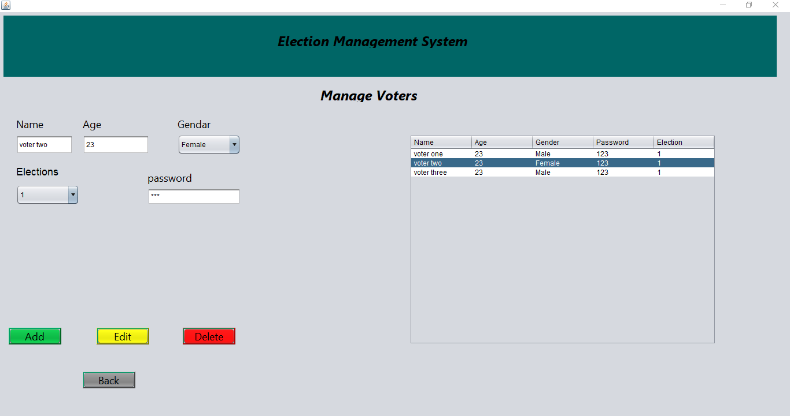
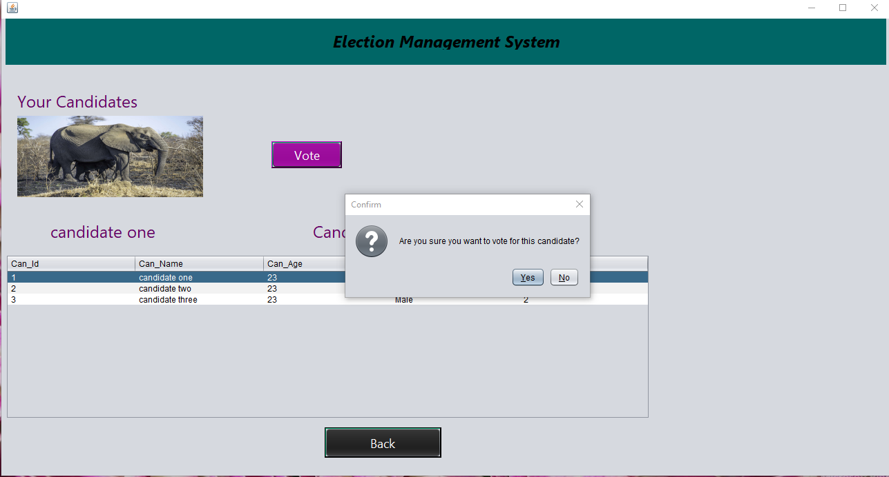
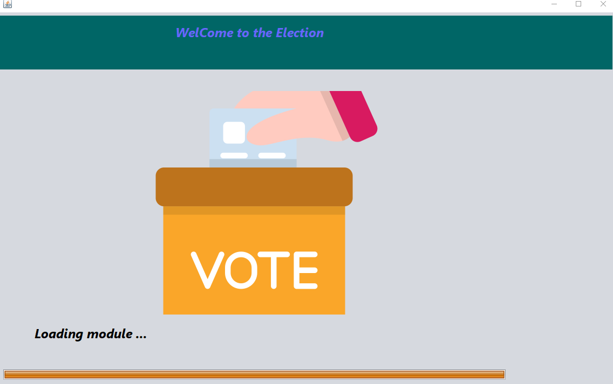
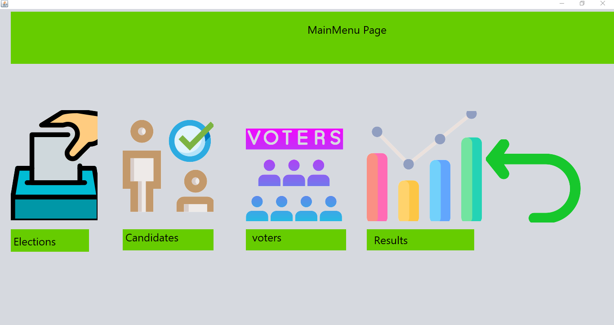
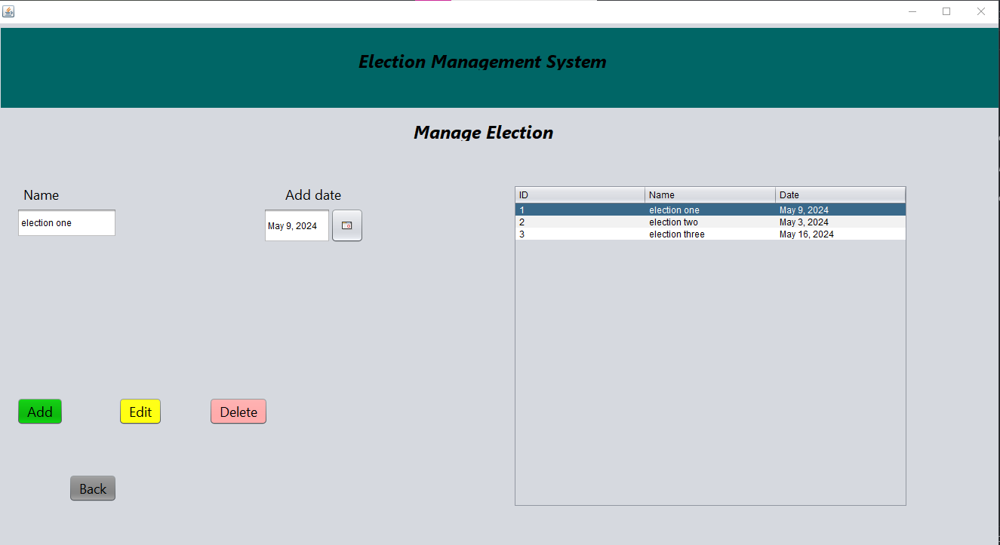
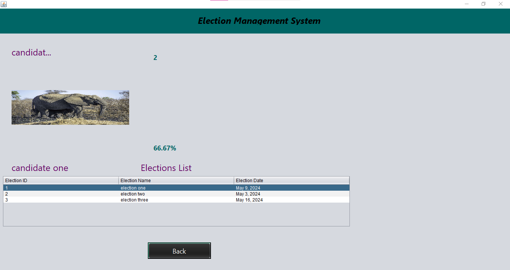
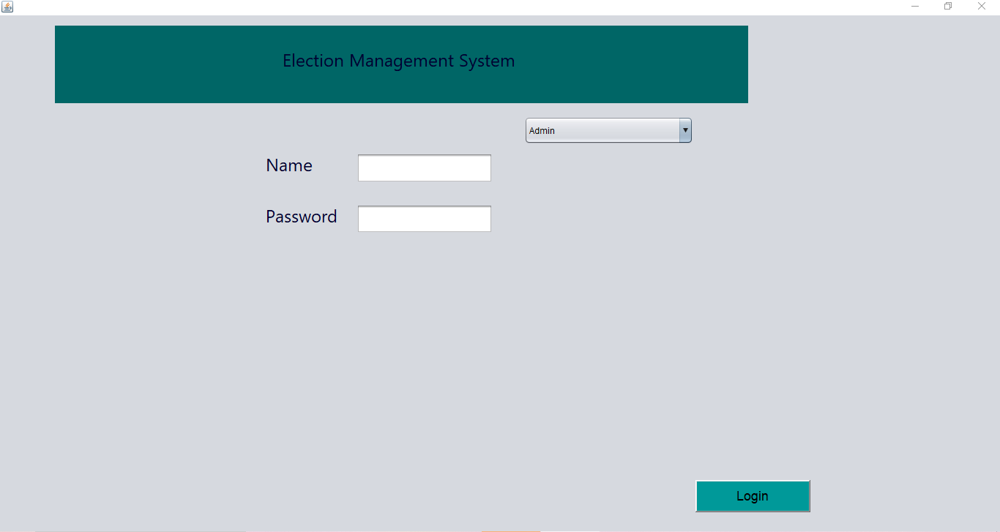
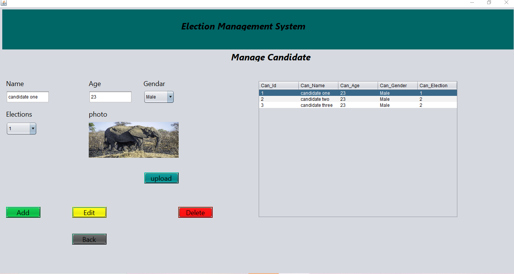
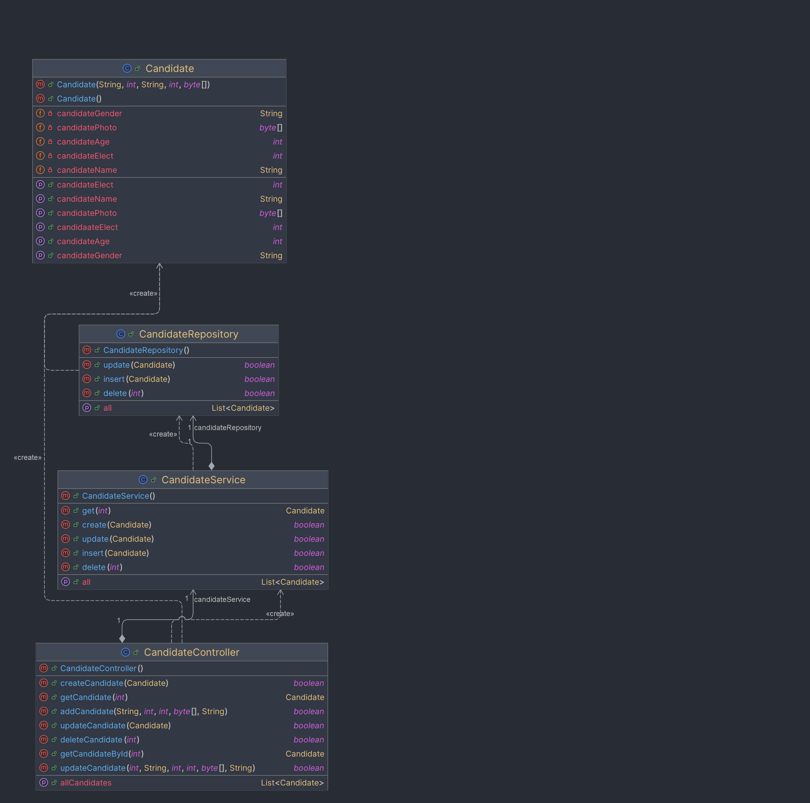
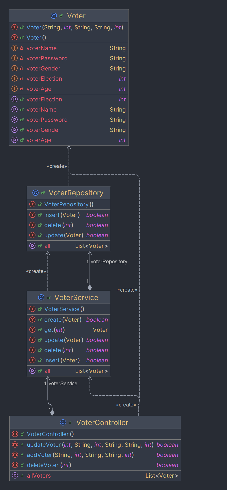

# ElectionMaster

ElectionMaster is a Java application that manages and analyzes voting data. It provides functionalities such as
calculating the winner of an election, updating voting records, deleting voting records, and retrieving all voting
records.

## Features

- Calculate the winner of an election based on vote count.
- Update voting records in the database.
- Delete voting records from the database.
- Retrieve all voting records from the database.

## Prerequisites

- Java 8 or higher
- Maven

## Installation

1. Clone the repository:
   ```bash
   git clone https://github.com/username/ElectionMaster.git
2. Navigate to the project directory:<pre>cd ElectionMaster </pre>
3. Build the project using Maven:<pre>mvn clean install </pre>
4. Run the application:<pre>java -jar target/ElectionMaster-1.0-SNAPSHOT.jar </pre>

# Documentation

The JavaDoc for this project is available in the doc directory. You can view it by opening the index.html file in a web
browser.

# Diagrams

## Pages Diagram



## Voting page



## Welcome page



## MainMenu page



## ELECTION PAGE



## ELECTION RESULT PAGE



## LOGIN PAGE



## Candidates Page



# UML Diagrams

## Candidate UML Diagram



## Election UML Diagram


## Voter UML Diagram



# Voting UML Diagram


